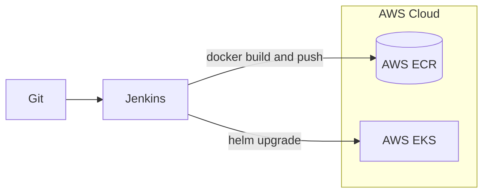
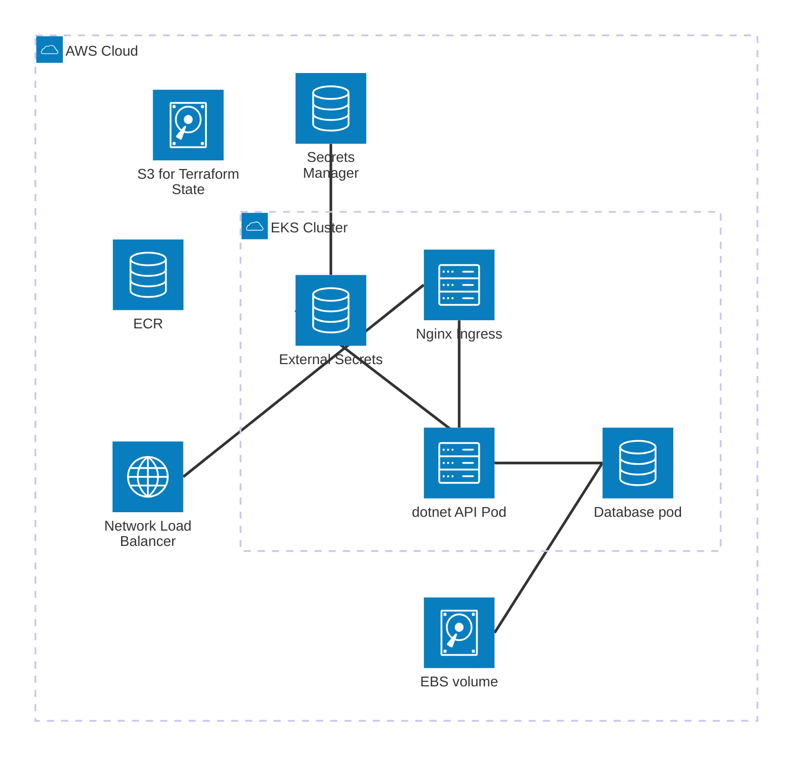

# Cloud-Native .NET Web API ☁️

.NET 8 web API with Docker & Helm packaging and Jenkins CI/CD pipeline for AWS EKS deployment.

## Web API

Simple .NET web API with health checks and a PostgreSQL connection.

## Packaging

### Docker image

A docker image can be created using the Dockerfile (base image: *mcr.microsoft.com/dotnet/aspnet*). The dockerfile features a multi-stage build to optimize resource consumption. The image creation is automated with the CI/CD pipeline, which creates and pushes the image to an AWS Elastic Container Registry.

### Helm chart

The API can be deployed to a Kubernetes cluster via a helm chart *(k8s/charts/dotnet-webapi)* that includes:

- **liveness and readiness probes**,
- customisable **resource requests and limits**,
- an **Ingress**.

The chart supports dynamic image versioning by providing the `image.tag` input parameter.

## CI/CD

The project contains a **Jenkinsfile** to handle continuous integration & continuous deployment, integrated with AWS infrastructure via the **Amazon ECR** and the **Pipeline: AWS Steps** Jenkins plugins.
The pipeline uses the helm chart to install the API onto an AWS EKS cluster.

Pipeline stages:

1. **Version info update:** the current version info is taken from the git tag
2. **Build image:** the API is built using the .NET 8.0 SDK and is packaged into an image containing the ASP.NET 8.0 runtime
3. **Push image:** the image gets pushed to an AWS Elastic Container Registry
4. **Deploy web API to Kubernetes:** Jenkins installs the web API onto an AWS EKS cluster using the helm chart

Jenkins accesses the AWS ECR and the AWS EKS with a dedicated AWS user following the principle of least privilege.

## Versioning

Versioning is handled via git tags.
The version is forwarded:

- to the web API via the .NET MinVer tool from the git tag, alongside the git commit hash
- to the docker image tag by the Jenkins pipeline

Jenkins adds the build number to the image tag to make each image uniquely identifiable.

## Infrastructure

The infrastructure is set up with an **Infrastructure as Code (IaC)** project that can be found under the following link:
[https://github.com/balintmolnar/aws-eks-platform-infra](https://github.com/balintmolnar/aws-eks-platform-infra). That project provides the following prerequisites for the web API to run on Kubernetes:

- an **Elastic Kubernetes Service (EKS) cluster**
- a **PostgreSQL database**
- a database **password** stored as a Kubernetes secret managed by the External Secrets Operator (ESO) tool
- an **NGINX Ingress Controller**
- an **AWS Elastic Container Registry** to store the docker image

*A diagram of the architecture made with Mermaid architecture-beta. The S3 bucket serves as the backend of the Terraform project, the ECR stores the container image.*

## How to run locally

To test the web API locally, use docker-compose:

`docker-compose up`

To check API health:

`curl http://localhost:8080/health/live`

The password included in *docker-compose.yaml* is only for testing purposes.

## How to deploy to EKS cluster

### Prerequisites

Prerequisites:

1. An EKS cluster with:
    - a PostgreSQL database
    - a Secret (with the name *db-password-k8s*) containing the database password
    - an NGINX Ingress Controller
2. A docker image repository.

You can use the following terraform project:
[https://github.com/balintmolnar/aws-eks-platform-infra](https://github.com/balintmolnar/aws-eks-platform-infra).

### Deployment

Configure access to the cluster:
`aws eks update-kubeconfig --name [cluster name] --region [region ID]` (An AWS CLI tool is needed. `[cluster name]` and `[region ID]` should be substituted with the actual cluster name and region ID).

To continue, the docker image should be built and pushed to the repository.

Install web API using helm:
`helm install dotnet-webapi k8s/charts/dotnet-webapi --namespace dotnet-app --set image.repository=YOUR_REPOSITORY_ADDRESS --set image.tag=YOUR_IMAGE_TAG`
(Helm CLI tool is needed)

## How to run pipeline

A Jenkins environment is needed with the following:

- **Amazon ECR** Jenkins plugin
- **Pipeline: AWS Steps** Jenkins plugin
- Credentials for an **AWS user** called aws-jenkins
  - with permissions to access:
    - AWS ECR registry
    - AWS EKS cluster
- Docker runtime
- AWS authenticator tool
- Helm CLI

The *ECR_REGISTRY_URL* variable needs to be updated to the actual image registry

## Some lessons learned

Some of the challenges encountered during development:

### EKS cluster permissions

- *Problem:* Jenkins couldn't run the 'helm upgrade' command in the cluster ("the server has asked for the client to provide credentials").
- *Solution:* Access policy association had to be configured for the Jenkins user to give it permission to deploy onto the cluster.
  
### Port number

- *Problem:* The web API pod failed liveness and readiness probes.
- *Solution:* The port number for the liveness and readiness probes was wrong. Fixing the port number resolved the issue.
